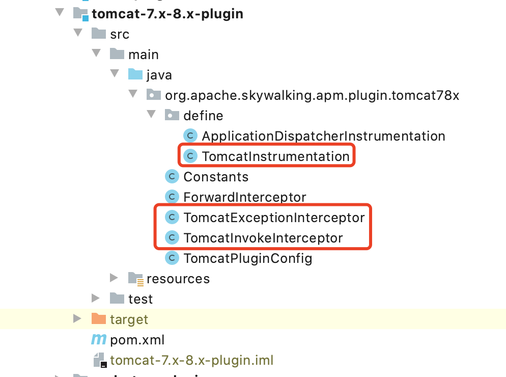
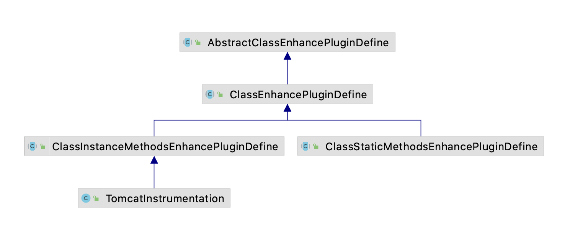

Apache SkyWalking Java Agent 06-插件定义体系

通过上一篇文章我们完成了插件定义类的加载和实例化（PluginBootstrap#loadPlugins方法）部分的代码解读，在文章的最后我们提到所有插件定义类都是 AbstractClassEnhancePluginDefine 类的子类，那接下来我们就一起看下 SkyWalking Java Agent 插件定义体系。

AbstractClassEnhancePluginDefine 是一个抽象类，它提供了如何对目标类增强的模版方法，define 方法是增强目标类的主要入口

```java
/**
 * Basic abstract class of all sky-walking auto-instrumentation plugins.
 * <p>
 * It provides the outline of enhancing the target class. If you want to know more about enhancing, you should go to see
 * {@link ClassEnhancePluginDefine}
 */
public abstract class AbstractClassEnhancePluginDefine {
    // 省略部分代码
    /**
     * Main entrance of enhancing the class.
     *
     * @param typeDescription target class description.
     * @param builder         byte-buddy's builder to manipulate target class's bytecode.
     * @param classLoader     load the given transformClass
     * @return the new builder, or <code>null</code> if not be enhanced.
     * @throws PluginException when set builder failure.
     */
    public DynamicType.Builder<?> define(TypeDescription typeDescription, DynamicType.Builder<?> builder,
        ClassLoader classLoader, EnhanceContext context) throws PluginException {
        String interceptorDefineClassName = this.getClass().getName(); // 当前增强插件的名字
        String transformClassName = typeDescription.getTypeName(); // 待增强类
        if (StringUtil.isEmpty(transformClassName)) {
            LOGGER.warn("classname of being intercepted is not defined by {}.", interceptorDefineClassName);
            return null;
        }

        LOGGER.debug("prepare to enhance class {} by {}.", transformClassName, interceptorDefineClassName);
      
        // 省略部分代码

        /**
         * find origin class source code for interceptor
         */
        DynamicType.Builder<?> newClassBuilder = this.enhance(typeDescription, builder, classLoader, context);

        // 省略部分代码

        return newClassBuilder;
    }


    /**
     * Begin to define how to enhance class. After invoke this method, only means definition is finished.
     *
     * @param typeDescription target class description
     * @param newClassBuilder byte-buddy's builder to manipulate class bytecode.
     * @return new byte-buddy's builder for further manipulation.
     */
    protected DynamicType.Builder<?> enhance(TypeDescription typeDescription, DynamicType.Builder<?> newClassBuilder,
                                             ClassLoader classLoader, EnhanceContext context) throws PluginException {
        newClassBuilder = this.enhanceClass(typeDescription, newClassBuilder, classLoader);

        newClassBuilder = this.enhanceInstance(typeDescription, newClassBuilder, classLoader, context);

        return newClassBuilder;
    }

    /**
     * Enhance a class to intercept constructors and class instance methods.
     * 增加构造方法和实例方法
     * @param typeDescription target class description
     * @param newClassBuilder byte-buddy's builder to manipulate class bytecode.
     * @return new byte-buddy's builder for further manipulation.
     */
    protected abstract DynamicType.Builder<?> enhanceInstance(TypeDescription typeDescription,
                                                     DynamicType.Builder<?> newClassBuilder, ClassLoader classLoader,
                                                     EnhanceContext context) throws PluginException;

    /**
     * Enhance a class to intercept class static methods.
     * 增强静态方法
     * @param typeDescription target class description
     * @param newClassBuilder byte-buddy's builder to manipulate class bytecode.
     * @return new byte-buddy's builder for further manipulation.
     */
    protected abstract DynamicType.Builder<?> enhanceClass(TypeDescription typeDescription, DynamicType.Builder<?> newClassBuilder,
                                                  ClassLoader classLoader) throws PluginException;

    /**
     * Define the {@link ClassMatch} for filtering class.
     *
     * @return {@link ClassMatch}
     */
    protected abstract ClassMatch enhanceClass();

    // 省略部分代码

    /**
     * Constructor methods intercept point. See {@link ConstructorInterceptPoint}
     * 构造方法拦截点
     * @return collections of {@link ConstructorInterceptPoint}
     */
    public abstract ConstructorInterceptPoint[] getConstructorsInterceptPoints();

    /**
     * Instance methods intercept point. See {@link InstanceMethodsInterceptPoint}
     * 实例方法拦截点
     * @return collections of {@link InstanceMethodsInterceptPoint}
     */
    public abstract InstanceMethodsInterceptPoint[] getInstanceMethodsInterceptPoints();

    /**
     * Static methods intercept point. See {@link StaticMethodsInterceptPoint}
     * 静态方法拦截点
     * @return collections of {@link StaticMethodsInterceptPoint}
     */
    public abstract StaticMethodsInterceptPoint[] getStaticMethodsInterceptPoints();
}

```

- define 方法是增强目标类的入口，内部调用 enhance 方法；
- enhance 方法定义如何增强目标类，内部调用了两个抽象方法 enhanceInstance 和 enhanceClass 方法，由子类实现；
- enhanceInstance 方法是一个抽象方法，用于增强目标类的构造方法和实例方法；
- enhanceClass 方法是一个抽象方法，用于增强目标类的静态方法；


SkyWalking Java Agent 使用了 ByteBuddy 库来操作类的字节码，实现对类的增强功能，所谓对目标类增强就是修改 Java 类的字节码，包括给类新增一个属性、让类实现一个接口，并实现接口中的方法，对类中的方法拦截（在方法执行前、执行后、抛异常等执行相应的方法，是不是和 AOP 有点像了），通过Java Agent 技术实现对字节码的修改，不需要应用修改源代码，实现代码无侵入。

那我们就要告诉 ByteBuddy 在哪些类对哪些方法进行拦截，拦截的是构造方法、实例方法还是静态方法，插件定义类就是做这个事的，下面是 AbstractClassEnhancePluginDefine 定义的相关抽象方法

- enhanceClass() 方法返回目标类的匹配规则，比如 NameMatch 的实现就是根据全类名匹配，IndirectMatch 间接匹配；

```java
/**
 * Define the {@link ClassMatch} for filtering class.
 *
 * @return {@link ClassMatch}
 */
protected abstract ClassMatch enhanceClass();
```

拦截点（Intercept Point）就是用来定义要增强的目标类的方法和对应的拦截器，SkyWalking 提供了三个拦截点，分别是构造方法拦截点（ConstructorInterceptPoint）、实例方法拦截点（InstanceMethodsInterceptPoint）和静态方法拦截点（StaticMethodsInterceptPoint）。

- 构造方法拦截点；

```java
/**
 * Constructor methods intercept point. See {@link ConstructorInterceptPoint}
 * 构造方法拦截点
 * @return collections of {@link ConstructorInterceptPoint}
 */
public abstract ConstructorInterceptPoint[] getConstructorsInterceptPoints();
```


- 实例方法拦截点；

```java
/**
 * Instance methods intercept point. See {@link InstanceMethodsInterceptPoint}
 * 实例方法拦截点
 * @return collections of {@link InstanceMethodsInterceptPoint}
 */
public abstract InstanceMethodsInterceptPoint[] getInstanceMethodsInterceptPoints();
```


- 静态方法拦截点；

```java
/**
 * Static methods intercept point. See {@link StaticMethodsInterceptPoint}
 * 静态方法拦截点
 * @return collections of {@link StaticMethodsInterceptPoint}
 */
public abstract StaticMethodsInterceptPoint[] getStaticMethodsInterceptPoints();
```

这里以 tomcat 插件为例，tomcat 插件的插件定义文件 skywalking-plugin.def 内容

```text
tomcat-7.x/8.x=org.apache.skywalking.apm.plugin.tomcat78x.define.TomcatInstrumentation
tomcat-7.x/8.x=org.apache.skywalking.apm.plugin.tomcat78x.define.ApplicationDispatcherInstrumentation
```

这里以 TomcatInstrumentation 为例，它是 AbstractClassEnhancePluginDefine 抽象类的一个实现

```java
public class TomcatInstrumentation extends ClassInstanceMethodsEnhancePluginDefine {

    /**
     * Enhance class.
     */
    private static final String ENHANCE_CLASS = "org.apache.catalina.core.StandardHostValve";

    /**
     * The intercept class for "invoke" method in the class "org.apache.catalina.core.StandardHostValve"
     */
    private static final String INVOKE_INTERCEPT_CLASS = "org.apache.skywalking.apm.plugin.tomcat78x.TomcatInvokeInterceptor";

    /**
     * The intercept class for "exception" method in the class "org.apache.catalina.core.StandardHostValve"
     */
    private static final String EXCEPTION_INTERCEPT_CLASS = "org.apache.skywalking.apm.plugin.tomcat78x.TomcatExceptionInterceptor";

    @Override
    protected ClassMatch enhanceClass() {
        return byName(ENHANCE_CLASS);
    }

    @Override
    public ConstructorInterceptPoint[] getConstructorsInterceptPoints() {
        return null;
    }

    @Override
    public InstanceMethodsInterceptPoint[] getInstanceMethodsInterceptPoints() {
        return new InstanceMethodsInterceptPoint[] {
            new InstanceMethodsInterceptPoint() {
                @Override
                public ElementMatcher<MethodDescription> getMethodsMatcher() {
                    return named("invoke");
                }

                @Override
                public String getMethodsInterceptor() {
                    return INVOKE_INTERCEPT_CLASS;
                }

                @Override
                public boolean isOverrideArgs() {
                    return false;
                }
            },
            new InstanceMethodsInterceptPoint() {
                @Override
                public ElementMatcher<MethodDescription> getMethodsMatcher() {
                    return named("throwable");
                }

                @Override
                public String getMethodsInterceptor() {
                    return EXCEPTION_INTERCEPT_CLASS;
                }

                @Override
                public boolean isOverrideArgs() {
                    return false;
                }
            }
        };
    }
}

```



TomcatInstrumentation 类重写了enhanceClass 方法，返回 tomcat 中要增强的目标类，说明对类 `org.apache.catalina.core.StandardHostValve`进行增强；

重写了getInstanceMethodsInterceptPoints 方法，说明对目标类的`invoke`和`throwable` 方法进行增强，对应的拦截器分别为`org.apache.skywalking.apm.plugin.tomcat78x.TomcatInvokeInterceptor`和`org.apache.skywalking.apm.plugin.tomcat78x.TomcatExceptionInterceptor`。


**TomcatInstrumentation 类继承体系**

ClassEnhancePluginDefine 是 AbstractClassEnhancePluginDefine 的抽象子类，实现了父类中的enhanceInstance 和 enhanceClass 方法，其中 enhanceInstance 方法用于增强目标类的构造方法和实例方法，enhanceClass 方法用于增强目标类的静态方法，具体实现细节我在后续文章中会进行详细介绍。

至此，我们对插件定义类有了一个大致的了解，简单说插件定义类就是插件（jar包）中的一个Java类，在skywalking-plugin.def 文件中声明，由 PluginBootstrap 负责查找和加载，它定义了拦截点（Intercept Point）用来定义要增强的目标类的方法和对应的拦截器，拦截器会在目标方法执行前、执行后、抛异常的时候执行相应的方法。

那么 AbstractClassEnhancePluginDefine#define 方法如何在 ByteBuddy 中使用的呢，我将在下一篇进行介绍，敬请关注。
