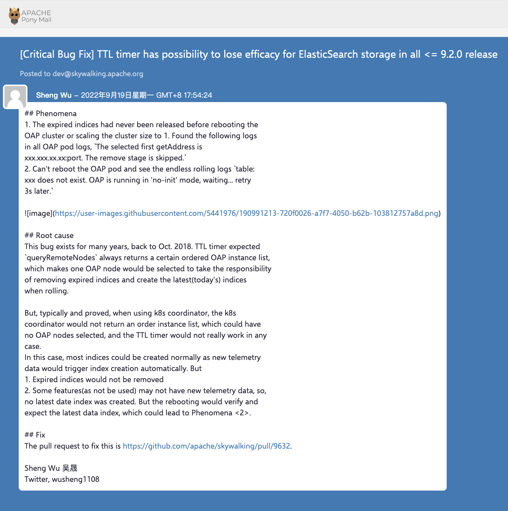
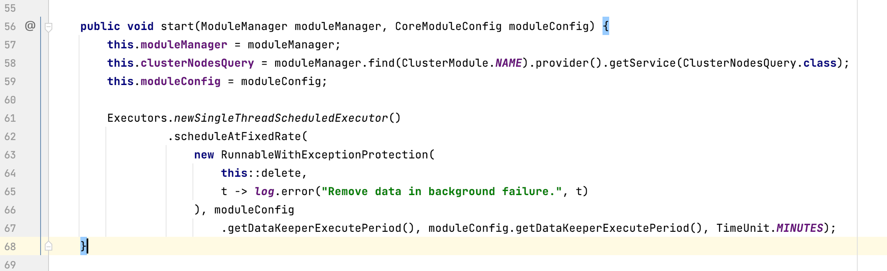
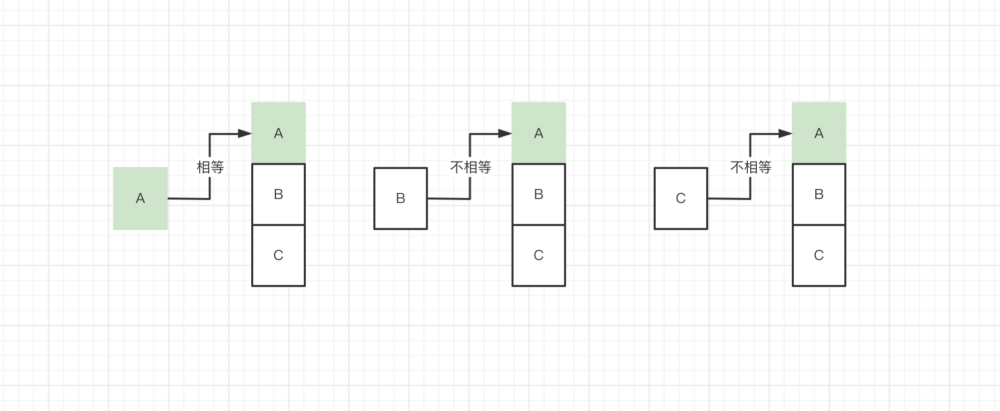
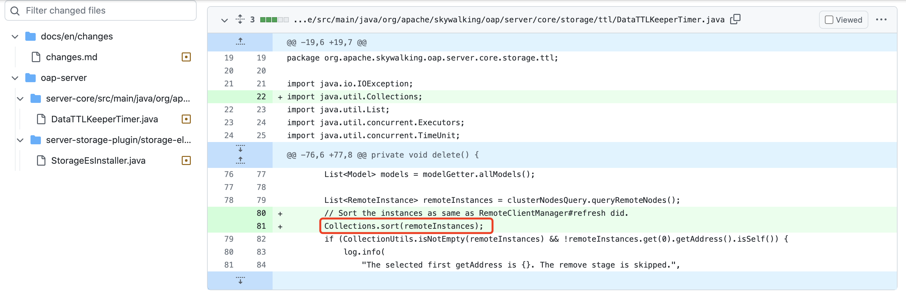

近期，Apache SkyWalking 修复了一个隐藏了近4年的Bug - TTL timer 可能失效问题，这个 bug 在 SkyWalking <=9.2.0 版本中存在。
关于这个 bug 的详细信息可以看邮件列表 https://lists.apache.org/thread/ztp4b3kc6swsc6d5bm4bjnc11h0bdtkz 如下


首先说下这个 Bug 导致的现象：
- 过期的索引不能被删除，所有的OAP节点都出现类似日志 `The selected first getAddress is xxx.xxx.xx.xx:port. The remove stage is skipped.`
- 对于以 `no-init` 模式启动的 OAP 节点，重启的时候会一直打印类似日志 `table:xxx does not exist. OAP is running in 'no-init' mode, waiting... retry 3s later.`

如果 SkyWalking OAP 出现上面的两个问题，很可能就是这个 Bug 导致的。

下面我们先了解一下 SkyWalking OAP 集群方面的设计

#### SkyWalking OAP 角色
SkyWalking OAP 可选的角色有 Mixed、Receiver、Aggregator
- Mixed 角色主要负责接收数据、L1聚合和L2聚合；
- Receiver 角色负责接收数据和L1聚合；
- Aggregator 角色负责L2聚合。

默认角色是 Mixed，可以通过修改 application.yml 进行配置
```yaml
core:
  selector: ${SW_CORE:default}
  default:
    # Mixed: Receive agent data, Level 1 aggregate, Level 2 aggregate
    # Receiver: Receive agent data, Level 1 aggregate
    # Aggregator: Level 2 aggregate
    role: ${SW_CORE_ROLE:Mixed} # Mixed/Receiver/Aggregator
    restHost: ${SW_CORE_REST_HOST:0.0.0.0}
    restPort: ${SW_CORE_REST_PORT:12800}
    
# 省略部分配置...  
```

L1聚合：为了减少内存及网络负载，对于接收到的 metrics 数据进行当前 OAP 节点内的聚合，具体实现参考 `MetricsAggregateWorker#onWork()` 方法的实现；

L2聚合：又称分布式聚合，OAP 节点将L1聚合后的数据，根据一定的路由规则，发送给集群中的其他OAP节点，进行二次聚合，并入库。具体实现见 `MetricsPersistentWorker` 类。


#### SkyWalking OAP 集群
OAP 支持集群部署，目前支持的注册中心有
- zookeeper
- kubernetes
- consul
- etcd
- nacos

默认是 standalone，可以通过修改 application.yml 进行配置
```yaml
cluster:
  selector: ${SW_CLUSTER:standalone}
  standalone:
  # Please check your ZooKeeper is 3.5+, However, it is also compatible with ZooKeeper 3.4.x. Replace the ZooKeeper 3.5+
  # library the oap-libs folder with your ZooKeeper 3.4.x library.
  zookeeper:
    namespace: ${SW_NAMESPACE:""}
    hostPort: ${SW_CLUSTER_ZK_HOST_PORT:localhost:2181}
    # Retry Policy
    baseSleepTimeMs: ${SW_CLUSTER_ZK_SLEEP_TIME:1000} # initial amount of time to wait between retries
    maxRetries: ${SW_CLUSTER_ZK_MAX_RETRIES:3} # max number of times to retry
    # Enable ACL
    enableACL: ${SW_ZK_ENABLE_ACL:false} # disable ACL in default
    schema: ${SW_ZK_SCHEMA:digest} # only support digest schema
    expression: ${SW_ZK_EXPRESSION:skywalking:skywalking}
    internalComHost: ${SW_CLUSTER_INTERNAL_COM_HOST:""}
    internalComPort: ${SW_CLUSTER_INTERNAL_COM_PORT:-1}
  kubernetes:
    namespace: ${SW_CLUSTER_K8S_NAMESPACE:default}
    
  # 省略部分配置...
```
OAP 启动的时候，如果当前角色是 Mixed 或 Aggregator，则会将自己注册到集群注册中心，standalone 模式下也有一个内存级集群管理器，参见 `StandaloneManager` 类的实现 。

#### Data TTL timer 配置

application.yml 中的配置

```yaml
core:
  selector: ${SW_CORE:default}
  default:
    # Mixed: Receive agent data, Level 1 aggregate, Level 2 aggregate
    # Receiver: Receive agent data, Level 1 aggregate
    # Aggregator: Level 2 aggregate
    role: ${SW_CORE_ROLE:Mixed} # Mixed/Receiver/Aggregator
    restHost: ${SW_CORE_REST_HOST:0.0.0.0}
    restPort: ${SW_CORE_REST_PORT:12800}
    # 省略部分配置...
    
    # Set a timeout on metrics data. After the timeout has expired, the metrics data will automatically be deleted.
    enableDataKeeperExecutor: ${SW_CORE_ENABLE_DATA_KEEPER_EXECUTOR:true} # Turn it off then automatically metrics data delete will be close.
    dataKeeperExecutePeriod: ${SW_CORE_DATA_KEEPER_EXECUTE_PERIOD:5} # How often the data keeper executor runs periodically, unit is minute
    recordDataTTL: ${SW_CORE_RECORD_DATA_TTL:3} # Unit is day
    metricsDataTTL: ${SW_CORE_METRICS_DATA_TTL:7} # Unit is day
    
    # 省略部分配置...
```
- enableDataKeeperExecutor 自动删除过去数据的执行器开关，默认是开启的；
- dataKeeperExecutePeriod 执行周期，默认5分钟；
- recordDataTTL record 数据的 TTL(Time To Live)，单位：天；
- metricsDataTTL metrics 数据的 TTL，单位：天。 

#### DataTTLKeeperTimer 定时任务
DataTTLKeeperTimer 负责删除过期的数据，SkyWalking OAP 在启动的时候会根据 `enableDataKeeperExecutor` 配置决定是否开启 DataTTLKeeperTimer，也就是是否执行 `DataTTLKeeperTimer#start()` 方法。 `DataTTLKeeperTimer#start()` 方法的执行逻辑主要是通过 JDK 内置的 `Executors.newSingleThreadScheduledExecutor()` 创建一个单线程的定时任务，执行 `DataTTLKeeperTimer#delete()` 方法删除过期的数据， 执行周期是`dataKeeperExecutePeriod` 配置值，默认5分钟执行一次。



#### Bug 产生的原因
`DataTTLKeeperTimer#start()` 方法会在所有 OAP 节点启动一个定时任务，那如果所有节点都去执行数据删除操作可能会有问题，那么如何保证只有一个节点执行呢？

如果让我们设计的话，可能会引入一个分布式任务调度框架或者实现分布式锁，这样的话 SkyWalking 就要强依赖某个中间件了，SkyWalking 可能是考虑到了这些也没有选择这么实现。

那我们看下 SkyWalking 是如何解决这个问题的呢，我们前面提到 OAP 在启动的时候，如果当前角色是 Mixed 或 Aggregator，则会将自己注册到集群注册中心，SkyWalking OAP 调用 `clusterNodesQuery#queryRemoteNodes()` 方法，从注册中心获取这些节点的注册信息（host:port）集合，
然后判断集合中的第一个节点是否就是当前节点，如果是那么当前节点执行过期数据删除操作，如下图所示


节点A和节点集合中的第一个元素相等，则节点A负责执行过期数据删除操作。

这就要求 `queryRemoteNodes` 返回的节点集合是有序的，为什么这么说呢， 试想一下，如果每个 OAP 节点调用 `queryRemoteNodes` 方法返回的注册信息顺序不一致的话，就可能出现所有节点都不和集合中的第一个节点相等，这种情况下就没有 OAP 节点能执行过期数据删除操作了，而 `queryRemoteNodes` 方法恰恰无法保证返回的注册信息顺序一致。


#### 解决 Bug
我们既然知道了 bug 产生的原因，解决起来就比较简单了，只需要对获取到的节点集合调用 `Collections.sort()` 方法对 `RemoteInstance`（实现了java.lang.Comparable 接口）做排序，保证所有OAP节点做比较时都是一致的顺序，代码如下


相关代码如下：
```java
/**
 * TTL = Time To Live
 *
 * DataTTLKeeperTimer is an internal timer, it drives the {@link IHistoryDeleteDAO} to remove the expired data. TTL
 * configurations are provided in {@link CoreModuleConfig}, some storage implementations, such as ES6/ES7, provides an
 * override TTL, which could be more suitable for the implementation. No matter which TTL configurations are set, they
 * are all driven by this timer.
 */
@Slf4j
public enum DataTTLKeeperTimer {
    INSTANCE;

    private ModuleManager moduleManager;
    private ClusterNodesQuery clusterNodesQuery;
    private CoreModuleConfig moduleConfig;

    public void start(ModuleManager moduleManager, CoreModuleConfig moduleConfig) {
        this.moduleManager = moduleManager;
        this.clusterNodesQuery = moduleManager.find(ClusterModule.NAME).provider().getService(ClusterNodesQuery.class);
        this.moduleConfig = moduleConfig;

        // 创建定时任务
        Executors.newSingleThreadScheduledExecutor()
                 .scheduleAtFixedRate(
                     new RunnableWithExceptionProtection(
                         this::delete, // 删除过期的数据
                         t -> log.error("Remove data in background failure.", t)
                     ), moduleConfig
                         .getDataKeeperExecutePeriod(), moduleConfig.getDataKeeperExecutePeriod(), TimeUnit.MINUTES);
    }

    /**
     * DataTTLKeeperTimer starts in every OAP node, but the deletion only work when it is as the first node in the OAP
     * node list from {@link ClusterNodesQuery}.
     */
    private void delete() {
        IModelManager modelGetter = moduleManager.find(CoreModule.NAME).provider().getService(IModelManager.class);
        List<Model> models = modelGetter.allModels();

        try {
            // 查询服务节点
            List<RemoteInstance> remoteInstances = clusterNodesQuery.queryRemoteNodes();
            if (CollectionUtils.isNotEmpty(remoteInstances) && !remoteInstances.get(0).getAddress().isSelf()) {
                log.info(
                    "The selected first getAddress is {}. The remove stage is skipped.",
                    remoteInstances.get(0).toString()
                );
                return;
            }
            // 返回的第一个节点是自己，则执行删除操作
            log.info("Beginning to remove expired metrics from the storage.");
            models.forEach(this::execute);
        } finally {
            log.info("Beginning to inspect data boundaries.");
            this.inspect(models);
        }
    }

    private void execute(Model model) {
        try {
            if (!model.isTimeSeries()) {
                return;
            }
            if (log.isDebugEnabled()) {
                log.debug(
                    "Is record? {}. RecordDataTTL {}, MetricsDataTTL {}",
                    model.isRecord(),
                    moduleConfig.getRecordDataTTL(),
                    moduleConfig.getMetricsDataTTL());
            }
            // 获取 IHistoryDeleteDAO 接口的具体实现
            moduleManager.find(StorageModule.NAME)
                         .provider()
                         .getService(IHistoryDeleteDAO.class)
                         .deleteHistory(model, Metrics.TIME_BUCKET,
                                        model.isRecord() ? moduleConfig.getRecordDataTTL() : moduleConfig.getMetricsDataTTL()
                         );
        } catch (IOException e) {
            log.warn("History of {} delete failure", model.getName());
            log.error(e.getMessage(), e);
        }
    }

    private void inspect(List<Model> models) {
        try {
            moduleManager.find(StorageModule.NAME)
                         .provider()
                         .getService(IHistoryDeleteDAO.class)
                         .inspect(models, Metrics.TIME_BUCKET);
        } catch (IOException e) {
            log.error(e.getMessage(), e);
        }
    }
}

```

更多技术细节大家可以参考下面的链接

相关链接
- https://lists.apache.org/thread/ztp4b3kc6swsc6d5bm4bjnc11h0bdtkz
- https://github.com/apache/skywalking/discussions/9634  
- https://github.com/apache/skywalking/pull/9632
