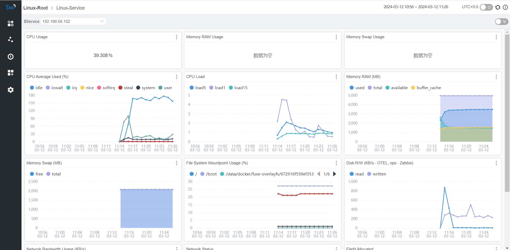

SkyWalking 从 8.4 版本开始支持监控主机，用户可以轻松从 dashboard 上检测可能的问题，例如当 CPU 使用过载、内存或磁盘空间不足或者当网络状态不健康时等。
与监控 MySQL Server 类似，SkyWalking 也是利用 Prometheus 和 OpenTelemetry 收集主机的 metrics 数据。
同时 SkyWalking 也提供了使用 InfluxDB Telegraf 通过 Telegraf receiver 接收主机的 metrics 数据，telegraf receiver 插件负责接收、处理和转换 metrics，
然后将转换后的数据发送给 SkyWalking MAL 处理。

方式一：Prometheus + OpenTelemetry，处理流程如下：

- Prometheus Node Exporter 从主机收集 metrics 数据.
- OpenTelemetry Collector 通过 Prometheus Receiver 从 Node Exporters 抓取 metrics 数据, 然后将 metrics 推送的到 SkyWalking OAP Server.
- SkyWalking OAP Server 通过 MAL 引擎去分析、计算、聚合和存储，处理规则位于 /config/otel-oc-rules/vm.yaml 文件.
- 用户可以通过 SkyWalking WebUI dashboard 查看监控数据。

方式二：通过 Telegraf receiver 具体参考官网文档的部署方式 https://skywalking.apache.org/docs/main/next/en/setup/backend/backend-vm-monitoring 。

### 部署
#### 部署 SkyWalking
之前的文章都是默认大家会部署 SkyWalking 的，这里我也提供下平时测试用的部署方式，我这里采用 docker compose 部署，主要是参考官网提供的部署配置，
SkyWalking 提供的部署基础配置在代码目录中，链接地址 https://github.com/apache/skywalking/tree/master/docker 。

##### docker-compose.yml
```yaml
# Licensed to the Apache Software Foundation (ASF) under one
# or more contributor license agreements.  See the NOTICE file
# distributed with this work for additional information
# regarding copyright ownership.  The ASF licenses this file
# to you under the Apache License, Version 2.0 (the
# "License"); you may not use this file except in compliance
# with the License.  You may obtain a copy of the License at
#
#     http://www.apache.org/licenses/LICENSE-2.0
#
# Unless required by applicable law or agreed to in writing, software
# distributed under the License is distributed on an "AS IS" BASIS,
# WITHOUT WARRANTIES OR CONDITIONS OF ANY KIND, either express or implied.
# See the License for the specific language governing permissions and
# limitations under the License.

version: '3.8'
services:
  elasticsearch:
    image: docker.elastic.co/elasticsearch/elasticsearch-oss:${ES_VERSION}
    container_name: elasticsearch
    ports:
      - "9200:9200"
    healthcheck:
      test: [ "CMD-SHELL", "curl --silent --fail localhost:9200/_cluster/health || exit 1" ]
      interval: 30s
      timeout: 10s
      retries: 3
      start_period: 10s
    environment:
      - discovery.type=single-node
      - bootstrap.memory_lock=true
      - "ES_JAVA_OPTS=-Xms512m -Xmx512m"
    ulimits:
      memlock:
        soft: -1
        hard: -1

  oap:
    image: ${OAP_IMAGE}
    container_name: oap
    depends_on:
      elasticsearch:
        condition: service_healthy
    links:
      - elasticsearch
    ports:
      - "11800:11800"
      - "12800:12800"
    healthcheck:
      test: [ "CMD-SHELL", "/skywalking/bin/swctl ch" ]
      interval: 30s
      timeout: 10s
      retries: 3
      start_period: 10s
    environment:
      SW_STORAGE: elasticsearch
      SW_STORAGE_ES_CLUSTER_NODES: elasticsearch:9200
      SW_HEALTH_CHECKER: default
      SW_TELEMETRY: prometheus
      JAVA_OPTS: "-Xms2048m -Xmx2048m"

  ui:
    image: ${UI_IMAGE}
    container_name: ui
    depends_on:
      oap:
        condition: service_healthy
    links:
      - oap
    ports:
      - "8080:8080"
    environment:
      SW_OAP_ADDRESS: http://oap:12800
      SW_ZIPKIN_ADDRESS: http://oap:9412

```

##### .env 
用于镜像版本，这里使用 SkyWalking 9.7.0 版本，也是当前最新的版本
```text
# The docker-compose.yml file is meant to be used locally for testing only after a local build, if you want to use it
# with officially released Docker images, please modify the environment variables on your command line interface.
# i.e.:
# export OAP_IMAGE=apache/skywalking-oap-server:<tag>
# export UI_IMAGE=apache/skywalking-ui:<tag>
# docker compose up

ES_VERSION=7.4.2
OAP_IMAGE=apache/skywalking-oap-server:9.7.0
UI_IMAGE=apache/skywalking-ui:9.7.0
```

启动 SkyWalking
```shell
docker compose up
```
启动完成后，访问 http://IP:8080 就可以正常打开 dashboard 页面了，当然这个时候还看不到监控数据。

#### 部署 Prometheus node-exporter
[node-exporter 官方文档](https://prometheus.io/docs/guides/node-exporter/) ，下载地址 [https://prometheus.io/download/#node_exporter](https://prometheus.io/download/#node_exporter)
这里下载 1.7.0 版本
```shell
wget https://github.com/prometheus/node_exporter/releases/download/v1.7.0/node_exporter-1.7.0.linux-amd64.tar.gz
tar xvfz node_exporter-1.7.0.linux-amd64.tar.gz
cd node_exporter-1.7.0.linux-amd64
./node_exporter
```
启动成功后访问 http://IP:9100/metrics 可以看到采集到的 metrics 信息。


#### 部署 OpenTelemetry Collector
[OpenTelemetry Collector 官方文档](https://opentelemetry.io/docs/collector/installation/)
这里将 `otel-collector` 和 skywalking 一起通过 docker compose 部署，完整配置如下：
```yaml
# Licensed to the Apache Software Foundation (ASF) under one
# or more contributor license agreements.  See the NOTICE file
# distributed with this work for additional information
# regarding copyright ownership.  The ASF licenses this file
# to you under the Apache License, Version 2.0 (the
# "License"); you may not use this file except in compliance
# with the License.  You may obtain a copy of the License at
#
#     http://www.apache.org/licenses/LICENSE-2.0
#
# Unless required by applicable law or agreed to in writing, software
# distributed under the License is distributed on an "AS IS" BASIS,
# WITHOUT WARRANTIES OR CONDITIONS OF ANY KIND, either express or implied.
# See the License for the specific language governing permissions and
# limitations under the License.

version: '3.8'
services:
  elasticsearch:
    image: docker.elastic.co/elasticsearch/elasticsearch-oss:${ES_VERSION}
    container_name: elasticsearch
    ports:
      - "9200:9200"
    healthcheck:
      test: [ "CMD-SHELL", "curl --silent --fail localhost:9200/_cluster/health || exit 1" ]
      interval: 30s
      timeout: 10s
      retries: 3
      start_period: 10s
    environment:
      - discovery.type=single-node
      - bootstrap.memory_lock=true
      - "ES_JAVA_OPTS=-Xms512m -Xmx512m"
    ulimits:
      memlock:
        soft: -1
        hard: -1

  oap:
    image: ${OAP_IMAGE}
    container_name: oap
    depends_on:
      elasticsearch:
        condition: service_healthy
    links:
      - elasticsearch
    ports:
      - "11800:11800"
      - "12800:12800"
    healthcheck:
      test: [ "CMD-SHELL", "/skywalking/bin/swctl ch" ]
      interval: 30s
      timeout: 10s
      retries: 3
      start_period: 10s
    environment:
      SW_STORAGE: elasticsearch
      SW_STORAGE_ES_CLUSTER_NODES: elasticsearch:9200
      SW_HEALTH_CHECKER: default
      SW_TELEMETRY: prometheus
      JAVA_OPTS: "-Xms2048m -Xmx2048m"

  ui:
    image: ${UI_IMAGE}
    container_name: ui
    depends_on:
      oap:
        condition: service_healthy
    links:
      - oap
    ports:
      - "8080:8080"
    environment:
      SW_OAP_ADDRESS: http://oap:12800
      SW_ZIPKIN_ADDRESS: http://oap:9412

  otel-collector:
    image: otel/opentelemetry-collector:0.50.0
    container_name: otel-collector
    command: [ "--config=/etc/otel-collector-config.yaml" ]
    volumes:
      - /opt/docker/skywalking/otel-collector-config.yaml:/etc/otel-collector-config.yaml
    expose:
      - 55678
```

在 /opt/docker/skywalking 目录（也可以自定义）创建配置文件 otel-collector-config.yaml
```yaml
# Licensed to the Apache Software Foundation (ASF) under one or more
# contributor license agreements.  See the NOTICE file distributed with
# this work for additional information regarding copyright ownership.
# The ASF licenses this file to You under the Apache License, Version 2.0
# (the "License"); you may not use this file except in compliance with
# the License.  You may obtain a copy of the License at
#
#     http://www.apache.org/licenses/LICENSE-2.0
#
# Unless required by applicable law or agreed to in writing, software
# distributed under the License is distributed on an "AS IS" BASIS,
# WITHOUT WARRANTIES OR CONDITIONS OF ANY KIND, either express or implied.
# See the License for the specific language governing permissions and
# limitations under the License.

receivers:
  prometheus:
    config:
      scrape_configs:
        - job_name: "vm-monitoring" # make sure to use this in the vm.yaml to filter only VM metrics
          scrape_interval: 10s
          static_configs:
            - targets: ["192.168.56.102:9100"] # OpenTelemetry Collector 的地址，根据自己的服务器IP进行调整

processors:
  batch:

exporters:
  otlp:
    endpoint: "oap:11800" # The OAP Server address
    # The config format of OTEL version prior to 0.34.0, eg. 0.29.0, should be:
    # insecure: true
    tls:
      insecure: true
    #insecure: true
  # Exports data to the console
  logging:
    loglevel: debug

service:
  pipelines:
    metrics:
      receivers: [prometheus]
      processors: [batch]
      exporters: [otlp, logging]

```
docker compose 重新启动
```shell
docker compose restart
```

访问 SkyWalking dashboard 页面，正常情况下就可以看到监控到的数据了。



相关链接
- https://skywalking.apache.org/docs/main/next/en/setup/backend/backend-vm-monitoring/
- https://skywalking.apache.org/blog/2021-02-07-infrastructure-monitoring/
- https://prometheus.io/docs/guides/node-exporter/
- https://opentelemetry.io/docs/collector/

